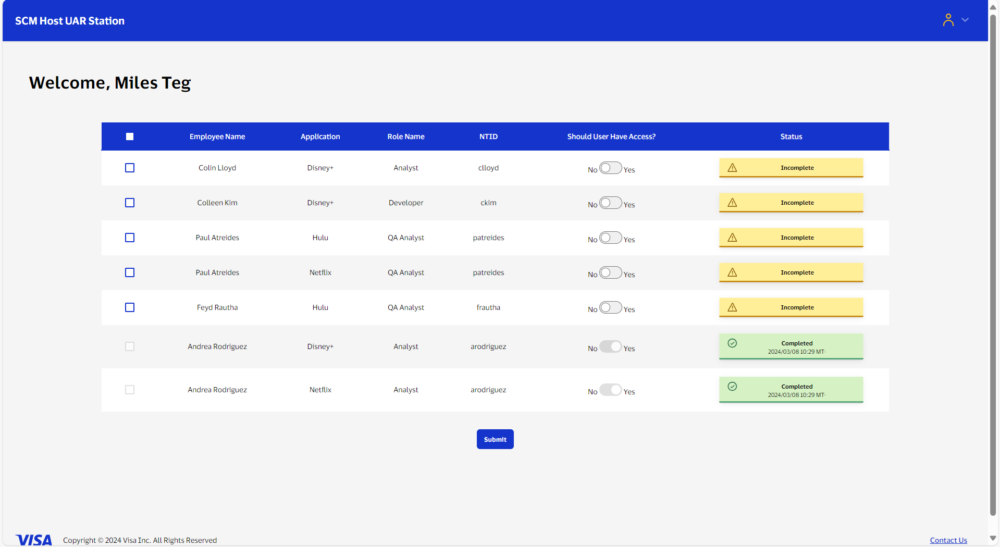

# Nolan Winsman Work Experience

This document is meant to be a historical record of most of primarily work programming projects. Since I can't share any of that code, this will be detailed descriptions of what I built.

# hOp

June 2021 To November 2021

# Visa

June 2022 To Present.

The following documentation outlines additional projects and initiatives undertaken to enhance my contributions and professional profile.

## Coding Projects

These are larger scale projects I did for my team.

### UAR (User Access Review) Station 

The UAR Station is a critical full-stack web application designed to facilitate user access review processes within our organization. This project streamlines the collection of attestations from managers regarding the necessity of software access for their employees.

#### Technical Components
- **Database Design**
    - Utilized GO scripts to gather user data from relevant applications and transform it into a third normal form (3NF) database structure using PostgreSQL. This database structure optimizes data integrity and reduces redundancy, ensuring efficient data management.
- **Backend Implementation**
    - Developed the backend using GO programming language with the Gin framework. The backend features numerous RESTful HTTPS endpoints that handle various functionalities of the application. This includes fetching employees with specific access permissions under a designated manager and facilitating the attestation process.
    - Implemented a robust PUT request mechanism to allow managers to submit attestations, which are then securely logged into the PostgreSQL database. This ensures accurate tracking and auditability of access reviews.
- **Frontend User Interface**
    - Constructed the frontend using Typescript with the React framework to provide managers with an intuitive and user-friendly interface. The frontend presents a simple yet effective table interface where managers can quickly make decisions (Yes/No) regarding access for their employees. Screenshot Below.

#### Additional Details

- **Integration and Workflow**
    - Orchestrated seamless integration between the frontend and backend components to create a cohesive user experience. This involved managing API calls, data retrieval, and real-time updates to reflect manager attestations accurately.
- **Security and Compliance**
    - Implemented robust security measures, including authentication and authorization protocols, to safeguard sensitive user data and ensure compliance with organizational security policies and regulations.

#### Impact and Results

The UAR Station significantly improved the efficiency and transparency of our user access review processes. By automating and centralizing attestation collection, it reduced manual effort and enhanced data accuracy. Moreover, the project demonstrated my proficiency in full-stack development, database management, and scalable web application architecture.

### SCL Parser

Created a `GO` script to parse **2,000,000+** lines of SCL data to compare differences between environments. Differences are then output into a simple `.html` file for easy visualization.

For instance if Envrionment `Dev01` has a System `System001` and Environment `Dev02` does not have that System, that would be outlined as a difference.

## Small Coding Scripts

These are scripts that all took less than 20 hours and were spent on my free time to automate something or make something easier at work.
 
- Completely Automated coworkers daily task of downloading two files from the Mainframe, renaming said files, and then uploading the files to Artifactory.
    - Task took roughly ten minutes and had to be done every day including weekends.
    - Wrote `GO` script that handles all of this and sends an email with a log of if the process was successful or not.
    - Script is scheduled using `cron` to run every morning at 9 A.M.

- Wrote `Python` email script to move [JIRA] emails in shared inbox to proper folders.
    - These emails are a little too complicated to move automatically with Outlook Rules so I decided to write this Python script to move them for me as our team constantly organizes these emails.
    - Takes roughly 30-90 seconds to move emails manually
    - Script has moved **1,072** Emails and created over **200** folders to store said emails

- SCM Code Migrations Automation
    - Some of our SCM management software is proprietary and lacking many basic features in the tool's API, that being said I have done my best to automate fragments around the process of our team's migrations using this tool from Dev to QA.
    - Wrote `GO` script to automate sending some emails for Dev to QA migrations. 
    When a ticket fails to compile, I kick off a script that emails the developers of the ticket the proper email that their code failed to compile and they need to fix it before it's moved to QA. These emails are annoying to send manually since you can't copy and 
    paste the developer emails, also the paragraphs of compilation information have to be fetched from the server. All of this is handled through the script.
    - Wrote `Python` script to automate creating load weeks. This process is done usually once a year and takes about two hours manually.
    - Wrote `GO` script that detects a user's expected department. Their department is a field that is required when creating a user on the proprietary SCM software. The manual way to do this is absolutely disgusting so I wrote a script to do it.

## Markdown Documentation Collection

I created a repository full of markdown files to organize documentation for everything involving our team. Covers everything from how to do almost every single support task we do, to how to get a linux server at our company and complete the proper RBAC forms.

- Files contain **27,519** words in total
- Files contain **5,906** lines

## Video Tutorials

Created video tutorials demonstrating examples of how to complete various tasks. Examples are primarily SCM migrations.

- Over two hours of filmed tutorials.

## Professional Development and Leadership

- Intern Site Coordinator (Summer 2024)
- Peer Mentored for Steup-Up bootcamp (August 2023 and March 2024)
- Executive for Young Professionals ERG
